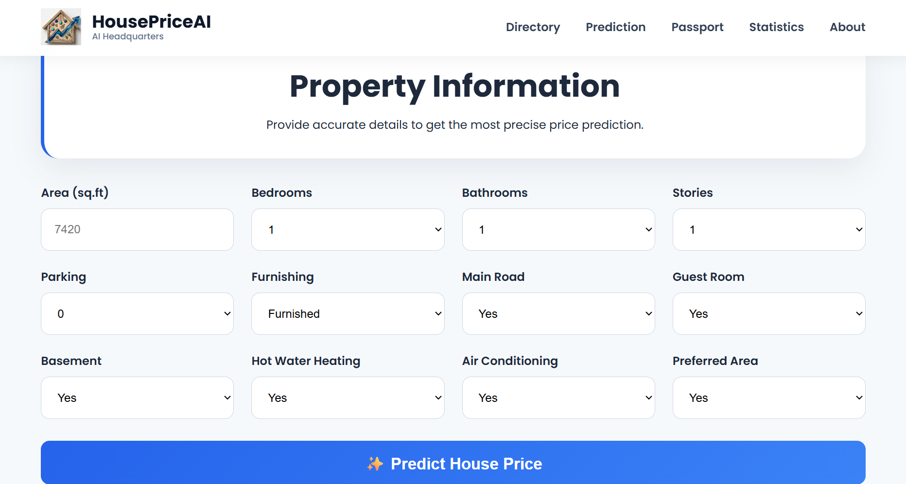
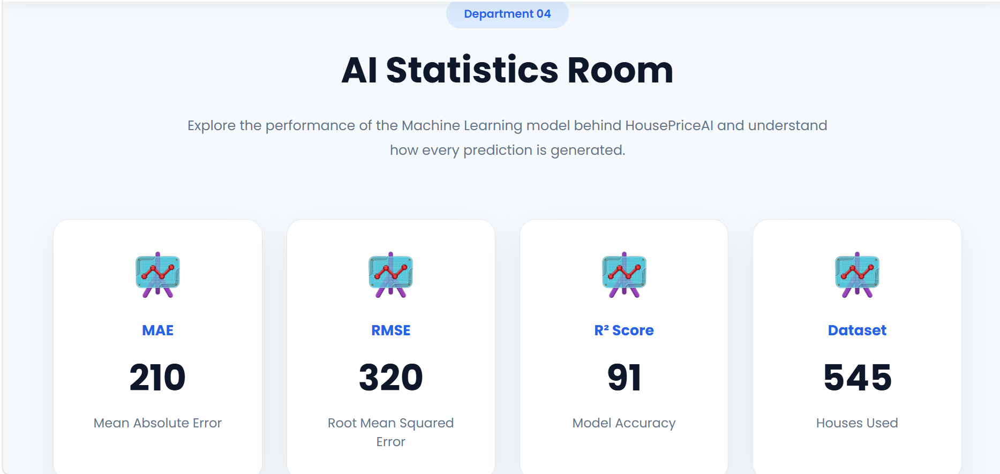

<p align="center">
  
</p>

<h1 align="center">
🏠 HousePriceAI
</h1>

<p align="center">

AI-powered House Price Prediction using Machine Learning, Flask and Scikit-Learn.

</p>

<p align="center">


</p>
---

## 📸 Project Preview

<p align="center">


</p>

<p align="center">



</p>

## 🚀 Features

- 🤖 AI-powered House Price Prediction
- 🏡 Modern and Interactive UI
- 📊 Property Summary Dashboard
- 📷 Property Image Gallery
- 📈 AI Statistics Dashboard
- 📱 Fully Responsive Design
- ⚡ Real-time Price Prediction using Flask

---

## 🛠 Tech Stack

### Frontend
- HTML5
- CSS3
- JavaScript

### Backend
- Python
- Flask

### Machine Learning
- Scikit-Learn
- Pandas
- NumPy
- Linear Regression
- StandardScaler

---

## 📂 Project Structure

```
HousePriceAI/
│
├── app.py
├── train_model.py
├── requirements.txt
├── README.md
│
├── dataset/
│   └── housing.csv
│
├── model/
│   ├── model.pkl
│   └── scaler.pkl
│
├── static/
│   ├── css/
│   ├── js/
│   └── images/
│
├── templates/
│   └── index.html
│
└── utils/
    └── predictor.py
```

---

## ⚙ Installation

Clone the repository:

```bash
git clone https://github.com/Inzila2130/HousePriceAI.git
```

Go to the project folder:

```bash
cd HousePriceAI
```

Create a virtual environment:

```bash
python -m venv venv
```

Activate it:

### Windows

```bash
venv\Scripts\activate
```

Install dependencies:

```bash
pip install -r requirements.txt
```

Run the application:

```bash
python app.py
```

Open your browser:

```
http://127.0.0.1:5000
```

---

## 🧠 Machine Learning Model

**Algorithm**

- Linear Regression

**Preprocessing**

- StandardScaler
- Feature Encoding

**Input Features**

- Area
- Bedrooms
- Bathrooms
- Stories
- Parking
- Main Road
- Guest Room
- Basement
- Hot Water Heating
- Air Conditioning
- Preferred Area
- Furnishing Status

---

## 📷 Screenshots

### 🏠 Home Page


---

### 🤖 Prediction Lab


---

### 🏡 Property Passport


---

### 📊 Statistics Room



---

## 🌐 Live Demo

**https://housepriceai-mwan.onrender.com**

---

---

# 📄 License

This project is licensed under the **MIT License**. See the [LICENSE](LICENSE) file for more details.

---

## 👩‍💻 Developer

**Inzila Danish Khan**

Machine Learning & AI Project

---

## Thank you for visiting this project. Feedback and suggestions are always appreciated.